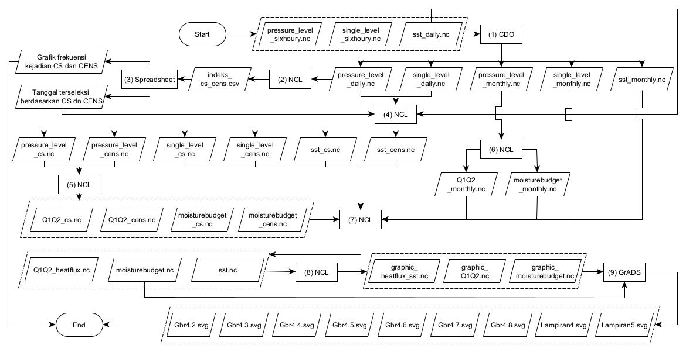

Repositori ini berisi gambaran singkat mengenai satu skripsi berikut dengan alur pengolahan datanya[^1].

# Proses pelembapan *cold surge* serta pengaruhnya terhadap *budget* uap air di Benua Maritim Bagian Barat

## Overview

Oleh karena pengaruhnya yang cukup signifikan di wilayah Indonesia, maka studi mengenai CS menjadi penting untuk terus dilakukan baik dalam perspektif kajian dinamis, fisis, maupun termodinamisnya. 

Proses dinamis fenomena CS berikut dampak yang ditimbulkan di daerah tropis dan subtropis hingga lintang tinggi serta interaksinya dengan fenomena lain telah dipahami dengan cukup komprehensif. Namun, proses fisis dan termodinamis dari propagasi CS di Benua Maritim khususnya di bagian barat belum dipahami secara lebih mendalam [^2].

Oleh karena itu, penelitian ini mencoba untuk mengkaji hal tersebut dengan fokus utamanya pada proses pelembapan (transformasi massa udara) massa udara CS serta pengaruh dari propagasi CS terhadap *budget* uap air di Benua Maritim Bagian Barat.

## Metode penelitian
Proses pelembapan CS dianalisis berdasarkan transfer energi dari laut ke atmosfer beserta dengan proses pada kolom vertikal atmosfer. Sementara itu, *budget* uap air dianalisis berdasarkan keseimbangan antara evaporasi minus presipitasi dengan kecenderungan *precipitable water* dan konvergensi transpor uap air.

### Data & alat
Penelitian ini sepenuhnya menggunakan data ECMWF *reanalysis v5*[^3].
1. *Single level* : per enam jam (00, 06, 12, 18 UTC)
   1. total precipitation $(P)$
   2. evaporation $(E)$
   3. surface latent heat flux (SLHF)
   4. surface sensible heat flux (SSHF)
2. *Pressure level* (1000-100 mb) : per enam jam (00, 06, 12, 18 UTC)
   1. temperature $(T)$
   2. specific humidity $(q)$
   3. horizontal wind component $(u, v)$
   4. vertical velocity $(w)$

Data diolah menggunakan CDO (untuk preprocessing), NCL (alat utama), *spreadsheet* (untuk identifikasi CS & CENS[^4]), dan GrADS (untuk visualisasi).

### Alur pengolahan data

|    |
|:--:|
|  *Diagram alir pengolahan data*  |

#### 1. Pre-processing : `(1) CDO`
Data beresolusi enam jam dirata-ratakan menjadi harian menggunakan CDO, memanfaatkan perintah `daymean`.

    daymean inputfile.nc outputfile.nc
    

#### 2. Mengidentifikasi CS dan CENS[^4] : `(2) NCL` & `(3) Spreadsheet`
Rata-rata angin meridional $(v)$ lapisan 925 mb di area 110-116⁰BT dan 8-15⁰LU (105-110⁰BT dan 5⁰LS-0) digunakan untuk mengidentifikasi CS (CENS) -yang kemudian dinamakan sebagai indeks CS dan CENS. Nilai $v$ tersebut diekstrak menggunakan NCL dengan memanfaatkan perintah [`wgt_areaave`](https://www.ncl.ucar.edu/Document/Functions/Built-in/wgt_areaave.shtml).

CS dan CENS kemudian diidentifikasi secara manual menggunakan *spreadsheet*, aktif apabila nilai indeksnya lebih dari 8 m/s (5 m/s) yang persisten selama enam (empat) hari berturut-turut[^5]. Nilai tertinggi dalam satu episode tersebut kemudian ditandai sebagai H0.

#### 3. Menyeleksi data : `(4) NCL`

#### 4. Mendefinisikan variabel : `(5) NCL` & `(6) NCL`

#### 5. Melakukan uji signifikansi : `(7) NCL`

#### 6. Post-processing : `(8) NCL`

#### 7. Visualisasi : `(9) NCL`

Jelaskan bagaimana alur secara runutnya

| Info | |
|----|----|
|  Penulis  |  Suwignyo Prasetyo  |
|  Pembimbing  |  Dr. Yosafat D. Haryanto, M.Si.  |
|  Penguji 1  | Dr. Aries Kristianto, M.Si. |
|  Penguji 2  | Imma Redha Nugraheni, M.Si. |
| | |

>The complete contents at this repository are under progres.

## Referensi
[^1]: Naskah skripsi lengkap dapat diakses melalui pranala berikut *[otw]*
[^2]: (Chang dkk., 2016 dan Yoden, dkk., 2017)
[^3]: Data dapat diakses secara bebas melalui pranala berikut
    
    single level : https://cds.climate.copernicus.eu/cdsapp#!/dataset/reanalysis-era5-single-levels
    
    multi/pressure level : https://cds.climate.copernicus.eu/cdsapp#!/dataset/reanalysis-era5-pressure-levels

[^4]: CENS = *cross equatorial northerly surge*, CS yang berpropagasi hingga melintasi garis ekuator.
[^5]: (Chang, dkk., 2005 dan Hattori, dkk., 2011)