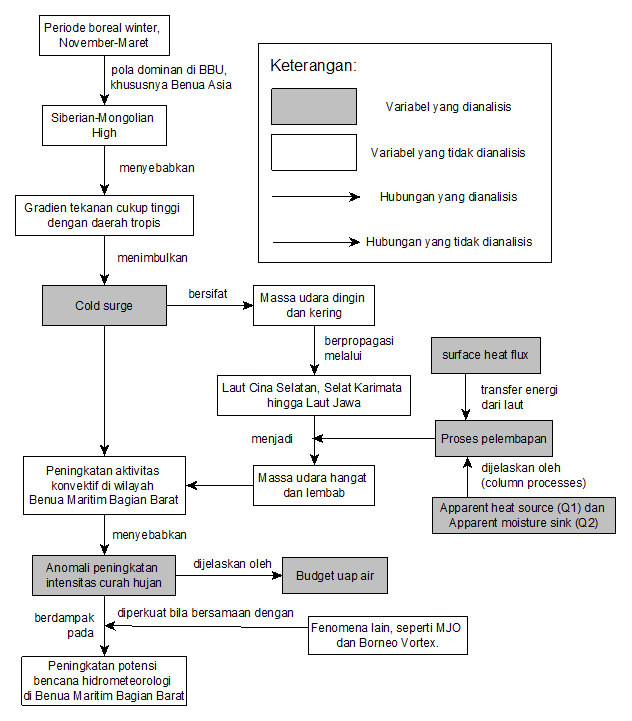

Repositori ini berisi gambaran singkat mengenai satu skripsi berikut dengan alur pengolahan datanya.

# Proses pelembapan *cold surge* serta pengaruhnya terhadap *budget* uap air di Benua Maritim Bagian Barat

Oleh karena pengaruhnya yang cukup signifikan di wilayah Indonesia, maka studi mengenai CS menjadi penting untuk terus dilakukan baik dalam perspektif kajian dinamis, fisis, maupun termodinamisnya.

Proses dinamis fenomena CS berikut dampak yang ditimbulkan di daerah tropis dan subtropis hingga lintang tinggi serta interaksinya dengan fenomena lain telah dipahami dengan cukup komprehensif *1.

Namun, proses fisis dan termodinamis dari propagasi CS di Benua Maritim khususnya di bagian barat belum dipahami secara lebih mendalam.

Oleh karena itu, penelitian ini mencoba untuk mengkaji hal tersebut dengan fokus utamanya pada proses pelembapan (transformasi massa udara) massa udara CS serta pengaruh dari propagasi CS terhadap *budget* uap air di Benua Maritim Bagian Barat.
<br><br>



Gambar di atas menampilkan kerangka berpikir

|       Info       |     |
|----|----|
|  Penulis  |  Suwignyo Prasetyo  |
|  Pembimbing  |  Dr. Yosafat D. Haryanto, M.Si.  |
|  Penguji 1  | Dr. Aries Kristianto, M.Si. |
|  Penguji 2  | Imma Redha Nugraheni, M.Si. |


<br>
Referensi<br>
*1: (Abdillah dkk., 2021; Chan dan Li, 2004; Chang dkk., 2005, 2006, 2016; Hattori dkk., 2011; Lim dkk., 2017; Xavier dkk., 2020)

*The complete contents in this repository are under progres.

---
title: Footnotes
syntax-id: footnotes
syntax-summary: |
  Here's a sentence with a footnote. [^1]

  [^1]: This is the footnote.
---

Footnotes allow you to add notes and references without cluttering the body of the document. When you create a footnote, a superscript number with a link appears where you added the footnote reference. Readers can click the link to jump to the content of the footnote at the bottom of the page.

To create a footnote reference, add a caret and an identifier inside brackets (`[^1]`). Identifiers can be numbers or words, but they can't contain spaces or tabs. Identifiers only correlate the footnote reference with the footnote itself — in the output, footnotes are numbered sequentially.

Add the footnote using another caret and number inside brackets with a colon and text (`[^1]: My footnote.`). You don't have to put footnotes at the end of the document. You can put them anywhere except inside other elements like lists, block quotes, and tables.

```
Here's a simple footnote,[^1] and here's a longer one.[^bignote]

[^1]: This is the first footnote.

[^bignote]: Here's one with multiple paragraphs and code.

    Indent paragraphs to include them in the footnote.

    `{ my code }`

    Add as many paragraphs as you like.
```

The rendered output looks like this:

Here's a simple footnote,[^1] and here's a longer one.[^bignote]

[^1]: This is the first footnote.

[^bignote]: Here's one with multiple paragraphs and code.

    Indent paragraphs to include them in the footnote.

    `{ my code }`

    Add as many paragraphs as you like.
